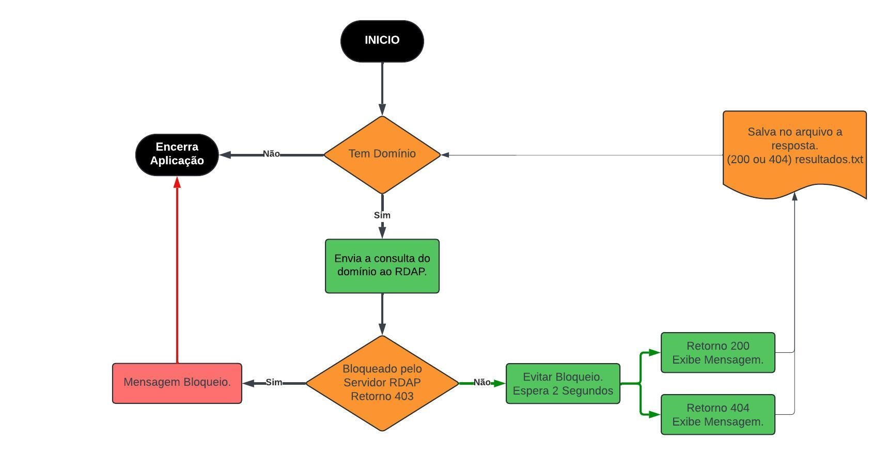

# RDAP Registro.br

Automação de consulta de domínios no RDAP do registro.br, simplificando a coleta de informações de registro de domínios brasileiros.

## Descrição do Projeto
Este projeto em Python realiza consultas automatizadas no servidor RDAP do registro.br para obter o status do dominio (existe ou não existe)

## Funcionalidades
Consulta Automatizada: Busca automática de dados RDAP para cada domínio listado no arquivo domain.txt.
Tratamento de Respostas HTTP: Lida com diferentes códigos HTTP (200, 404, 403), garantindo a continuidade e robustez das consultas.

Geração de Relatórios: Exporta o status dos domínios se existe 200 se não existe 404 e salva em um arquivo chamado resultados.txt.

## Pré-requisitos
Python 3.x

Bibliotecas: requests, datetime, time, sys, os

### Instale os requisitos, se necessário:

requests, time, datetime, sys, os

## Base de domínios
Adicione os domínios que deseja consultar em um arquivo domain.txt no mesmo diretório do script 1 domínio por linha.

Uso
Execute o script app.py para iniciar as consultas:

## Resultados
O arquivo resultados.txt é gerado automaticamente, contendo uma linha para cada domínio consultado.

As respostas serão salvas em resultados.txt com as seguintes informações para cada domínio nome do domínio;código.
Exemplo: dominio.com.br;200

# Contribuições
Contribuições são bem-vindas! Sinta-se à vontade para abrir issues ou pull requests para aprimorar o projeto.

# Licença
Este projeto está licenciado sob a licença MIT. Veja o arquivo LICENSE para mais detalhes.
